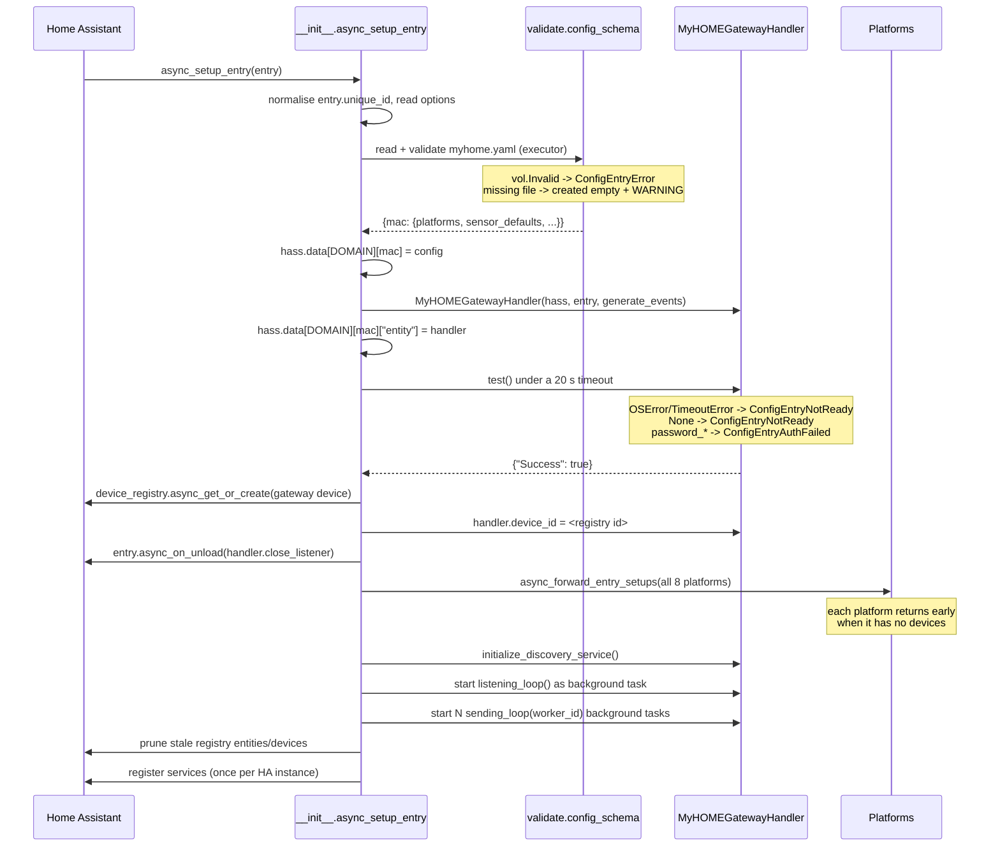
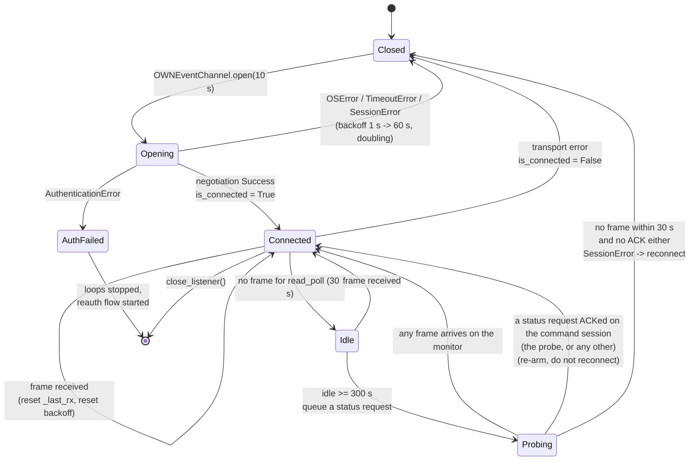
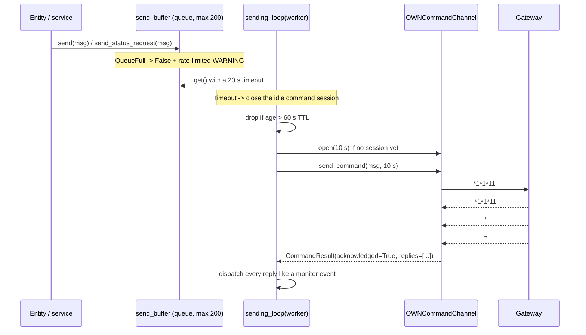

# Architecture

How the integration works inside. This page is for contributors, and for anyone
who wants to check the claims in the README against the code rather than take
them on trust.

Everything below is from `custom_components/myhome/*.py` on `master` (the state
that will ship as the next release) and `OWNd` 0.7.49.

## Contents

- [Module map](#module-map)
- [`hass.data` layout](#hassdata-layout)
- [Config entry lifecycle](#config-entry-lifecycle)
- [The two OpenWebNet sessions](#the-two-openwebnet-sessions)
- [The command queue](#the-command-queue)
- [Availability](#availability)
- [Statistics and diagnostics (0.3.0)](#statistics-and-diagnostics-030)
- [The dispatcher](#the-dispatcher)
- [The instant-power throttle](#the-instant-power-throttle)
- [The validator contract](#the-validator-contract)
- [Test strategy](#test-strategy)

## Module map

| File | Responsibility |
|---|---|
| `__init__.py` | Config entry lifecycle (setup, unload, migration), YAML loading, registry pruning, service registration. |
| `const.py` | Domain, `hass.data` layout keys, the connection signal name, every `myhome.yaml` key constant, defaults, and the discovery device-type tables. |
| `validate.py` | The `myhome.yaml` schema: WHERE/zone/MAC validators, per-platform field sets, alias folding, defaults injection, rekeying to `who-where`, duplicate detection, lock-button generation. |
| `gateway.py` | One `MyHOMEGatewayHandler` per gateway: the event session loop, the command worker(s), the message dispatcher, the instant-power throttle, availability publication, shutdown. |
| `own_session.py` | Thin subclasses of `OWNd`'s `OWNSession` that raise instead of returning `None`, add TCP keepalive, and read a command's replies until its ACK/NACK. |
| `myhome_device.py` | `MyHOMEEntity`, the base class of every entity: availability, device info, registration in `hass.data`, naming rules; plus `address_attributes()`. |
| `config_flow.py` | Config flow (gateway picker, manual entry, SSDP, port, password), reauth flow, options flow. |
| `discovery.py` | The bus-listening discovery service: a 60 s run, message classification, the public `myhome_device_discovered` / `myhome_discovery_completed` events. |
| `config_flow_discovery.py` | Turns discovered devices into YAML suggestions and writes `myhome_discovered.yaml` atomically. Never touches `myhome.yaml`. |
| `light.py` | WHO 1 lights and dimmers (brightness, transition, flash). |
| `switch.py` | WHO 1 actuators driving non-light loads. |
| `cover.py` | WHO 2 shutters: real position on advanced actuators, time-based estimate on basic ones. |
| `climate.py` | WHO 4 thermoregulation zones and central unit. |
| `sensor.py` | Instant power (with the keep-alive), the three energy totalisers, temperature, illuminance; the `start_sending_instant_power` entity service. |
| `binary_sensor.py` | WHO 25 dry contacts, WHO 9 auxiliary channels, WHO 1 motion sensors (with timeout). |
| `button.py` | The opt-in WHO 14 Lock/Unlock buttons. |
| `event.py` | WHO 15 / WHO 25 CEN and CEN+ scenario controls: one stateless `EventEntity` per declared keypad, fed by the gateway dispatcher. |
| `device_trigger.py` | The device-automation platform: per-button, per-event-name triggers for those keypads, delegated to Home Assistant's own event trigger. |
| `diagnostics.py` | The Download-diagnostics payload: identity masking, the config summary, the handler snapshot and the redacted frame ring buffer. |
| `services.yaml`, `manifest.json`, `strings.json`, `translations/{en,fr,it,nl}.json` | Service schemas for the UI, integration metadata and SSDP matchers, the source strings and their translations. |

## `hass.data` layout

Only per-gateway dicts, keyed by MAC address, live under `hass.data["myhome"]`:

```python
hass.data["myhome"][mac] = {
    "platforms": {
        "light":  {"1-11": {..., "entities": {"light": <MyHOMELight>}}},
        "cover":  {"2-81": {..., "entities": {"cover": <MyHOMECover>}}},
        "sensor": {"18-51": {..., "entities": {
            "power": <MyHOMEPowerSensor>,
            "total-energy": <MyHOMEEnergySensor>,
            # daily-energy / monthly-energy when enabled
        }}},
        "button": {"2-81": {..., "source_platform": "cover", "entities": {...}}},
    },
    "sensor_defaults": {...},   # merged power filter + keep-alive defaults
    "entity": <MyHOMEGatewayHandler>,
    # plus any unrecognised gateway-level keys, kept verbatim
}
```

The device keys are `"{who}-{where}"`, `"{who}-{where}#4#{interface}"` behind a
bus interface, and `"{who}-{zone}"` for climate. Entities register themselves in
their device's `entities` dict on `async_added_to_hass` and remove themselves on
`async_will_remove_from_hass`.

The bus interface is **zero padded in the device key only** (`1-11#4#03`), because
that key is also the tail of every entity `unique_id`. The `interface` value in the
device config — and therefore every frame the integration sends — is the unpadded
bus form (`11#4#3`). The dispatcher normalises incoming keys
(`gateway._entity_key_candidates`) so both spellings resolve to the same entity.

## Config entry lifecycle

### Setup order



Two ordering decisions matter:

- The **handler is created after** `hass.data[DOMAIN][mac]` is populated, because
  it reads its energy defaults from there.
- The **loops start after the platforms are forwarded**, so no bus frame is ever
  dispatched into a half-built entity map.

The whole per-gateway dict is replaced on every setup — never merged into
leftovers from a previous one.

### Unload order

```
stop_device_discovery()
  -> close_listener()          # stop the loops, close sessions, drop the queue,
                               # publish is_connected = False
  -> async_unload_platforms(all 8)
  -> hass.data[DOMAIN].pop(mac)
  -> unregister services if this was the last loaded entry
```

If a platform refuses to unload, the failure is logged as an error and the entry is
left unloaded: the sockets are already closed by then, so the entry has to be
reloaded to work again.

`close_listener()` is idempotent and is also registered through
`entry.async_on_unload`, so a setup that fails half way still closes its sockets.
It is safe to call from inside one of the loop tasks (it skips
`asyncio.current_task()` when cancelling).

Because the connection is closed *before* the platforms are unloaded, every
entity is already `unavailable` when Home Assistant snapshots states for
restoration. That is why `cover.py` persists its position through
`extra_restore_state_data` rather than through the state attributes.

### Migration

`async_migrate_entry` moves entries from version 1 to version 2 by unwrapping the
1-element lists the pre-0.2.0 manual flow stored for `manufacturer`,
`manufacturerURL`, `firmware`, `ssdp_location`, `ssdp_st`, `deviceType`,
`friendly_name` and `UDN`. An entry with a *higher* version than the code returns
`False` rather than corrupting itself.

## The two OpenWebNet sessions

OpenWebNet gateways expose two session types, selected by the first frame after
the greeting:

| Frame | Session | Used for |
|---|---|---|
| `*99*1##` | **event** (monitor) | The gateway pushes every bus frame. One per gateway, permanently open. |
| `*99*0##` | **command** | Send a frame, read its replies, read the ACK/NACK. One per command worker, closed after 20 s idle. |



### `own_session.py`: why `OWNd` is wrapped

`OWNd`'s own session methods never raise. `connect()` returns `None` after five
refused attempts (three for `test_connection()`) or
`{"Success": False, "Message": ...}` after a negotiation failure; `send()` and
`get_next()` swallow every exception and return `None`. The handler could not tell
"the gateway is rebooting" from "a frame arrived".

`OWNChannel` subclasses `OWNSession`, so the negotiation and password code is
still `OWNd`'s (the package is pinned and untouched), but:

- **`open(timeout)`** makes **one** connection attempt inside `asyncio.timeout`,
  enables TCP keepalive on the socket (idle 30 s, interval 10 s, 3 probes, applied
  only where the platform provides the option), runs `OWNd`'s `_negotiate()`, and
  then **verifies the result**. A `Message` of `password_error`,
  `password_required` or `password_retry` becomes `AuthenticationError`; any other
  failure becomes `SessionError`; connect failures propagate as `OSError` /
  `TimeoutError`. The socket is always closed on failure. Retry and backoff belong
  to the caller.
- **`read_frame()` / `get_next()`** raise `SessionError` on EOF
  (`IncompleteReadError`) and on over-long frames, and let `OSError` through. A
  frame `OWNd`'s parser cannot handle — including the frames on which
  `OWNMessage.parse` itself raises, such as a short WHO 13 frame or a CEN+ frame
  without `#n` — comes back as its raw text, never as an exception. Cancelling the
  read (which the listening loop does on every poll timeout) is safe: the stream
  buffer is preserved.
- **`close()`** never raises, and is safe before `open()` and when called twice.

### `send_command()`: reading replies until ACK



`send_command` writes the frame, then reads frames until it sees an `OWNSignaling`
ACK or NACK. Every non-signaling `OWNMessage` in between is collected into
`CommandResult.replies`; unparsable text is logged and discarded. This is what
makes multi-frame status and energy replies reach the entities instead of
desynchronising the session — the reason the energy totalisers were dead before
0.2.0. On timeout or transport error the channel is marked not open, because an
unknown number of late frames may still be in flight: the caller must discard it.

## The command queue

| Property | Value | Behaviour |
|---|---|---|
| Bounded | `maxsize=200` | `put_nowait` raises `QueueFull`; `send()` returns `False` and logs a rate-limited WARNING. `myhome.send_message` turns that `False` into a visible `HomeAssistantError`. |
| TTL | `60 s` | Checked when the item is dequeued, not while it waits. An expired command is dropped with a WARNING, never sent. |
| Stop priority | WHO 2 `*2*0*<where>##` | A stop overtakes any movement or status frame queued for **other** devices, so it is not delayed by a scene that is still being written. Behind a frame of its own device it is inserted right after that frame, not at the tail of everyone else's — a status request for that device does not hold it back either. "Same device" is `(WHO, WHERE, bus interface)`, so a light and a cover that happen to share a WHERE are told apart. |
| Timeout | `10 s` | Per `send_command` call: write + drain + read until ACK/NACK. |
| Delivery report | at the answer | A command that asked to be told when it reaches the bus is told once the gateway has answered it — an acknowledgement or a refusal — and the timestamp it is given is the instant of the write that was answered, not of the report. A write that returns proves nothing: a gateway that has closed an idle session accepts the bytes and drops them, and only the missing answer says so. A command no attempt was answered for is dropped, and its caller is told that instead. |
| Retry | **once**, in place | On any transport error the session is closed and one fresh session is opened for a second attempt, whether or not the first write returned: a frame that left the socket and was never answered may equally well have gone into a session the gateway had closed, and these commands are harmless to repeat. |
| Drop | after the second failed attempt | A rate-limited WARNING names the command. It is **never re-queued**: a stale command is never replayed minutes later. A command is dropped when no attempt was answered, and its caller is told it never reached the bus. |
| Auth failure | immediate stop | `AuthenticationError` on a command session stops both loops and starts the reauth flow. |
| Backoff | `1 s → 60 s` | Applied inside the sending loop after a failed delivery, reset on the first success. |

Queued items carry an `is_status_request` flag (set by `send_status_request`). It
is what lets `_has_pending_status()` coalesce an identical status frame that is
still waiting in the queue (ordinary commands are never coalesced), and an ACKed
status request is what tells the idle watchdog that the gateway is alive even
when it does not mirror the reply onto the monitor session. Both kinds are logged
identically at DEBUG.

`close_listener()` drains whatever is left and logs the discarded commands (up to
the first ten by name).

### Delivery order and delivery instants (0.4.3)

`send()` only *queues* a frame and returns. The frames are written by
`command_worker_count` sending loops — one by default, four at most, each with its own
command session — and one frame costs about **0.1 s** on a MyHOMEServer1: open the
session if it had gone idle, write, read replies until the ACK. A dozen commands
issued in the same instant therefore reach the bus spread over more than a second.
That is invisible for a light, and decisive for a cover that times its own run.

**Stops jump the queue, except their own device's.** `_CommandQueue` is an
`asyncio.Queue` subclass with a second deque for WHO 2 stop frames (`*2*0*<where>##`): a
queued stop is handed to a worker before any movement or status frame waiting for
**other** devices, so a stop is not held up by a scene that is still being written. It
enters that deque only when nothing else for the same device is waiting; when a
movement frame for that device is itself still queued, the stop is inserted right
behind the last one of them — not appended behind everyone else's frames too — so a
scene moving a dozen other covers can no longer make the stop wait for all of them,
while the frames of that one device still reach the bus in the order they were asked
for. "Same device" is `(WHO, WHERE, bus interface)`, so a WHO 1 light and the cover at
the same WHERE, or the same WHERE on two bus interfaces, are never confused with one
another; a status request for that device does not count either, since reordering a
reply changes nothing. Ordering among stops, and among everything else, stays FIFO. A
late stop lengthens a run exactly as a late start shortens it, so the frame that *ends*
a movement is the one worth prioritising. The bound (`COMMAND_QUEUE_MAXSIZE`), the TTL,
`task_done()` / `join()`, the published `queue_length` and `diagnostics.queue_size` are
all still the **total** of both.

**A queued command reports what became of it.** `send()` and `send_status_request()`
take two keyword-only callables, `on_delivered(at)` and `on_dropped()`; exactly one of
the two fires, exactly once, on the event loop. `on_delivered` fires once the gateway has answered the frame, and carries the monotonic
timestamp taken immediately *before* the write it answered — the second one when the first
attempt was lost, so a cover times its motor from the write that really reached the bus. A
NACK counts: the gateway has the frame, and what the bus makes of it is what the monitor
frames will say. No answer at all does not: the command is retried and then dropped, and
`on_dropped` is what its caller gets. `on_dropped` covers every path that loses the command: queue
closed, queue full, TTL expired, authentication failure, attempts exhausted, the
worker's catch-all arm, the drain in `close_listener()`, and a worker cancelled
mid-write. An exception raised inside either callback is logged and swallowed, like
every other call into an entity, and the command still counts as settled.

`MyHOMECover` is so far the only caller that asks. A basic cover starts its movement
clock optimistically at the enqueue — the entity reacts to the service call at once —
and re-bases it when the delivery is reported: `_move_started_at`, the echo window and
the pending timed stop all move onto `delivered + start_delay` (since 0.4.4; 0.4.3
moved them onto the delivery instant itself), converted from the gateway's monotonic
clock by measuring the offset between the two clocks at callback time. Until that
report arrives the echo window stays open however long the wait: the gateway cannot
repeat a frame it has not been given, so the repeat is still to come — and it comes on
the monitor session a millisecond after the write, which can be before the report. A
delivery no later than the optimistic start changes nothing, which is what makes the
behaviour with an idle queue identical to 0.4.2. If the actuator's own "moving" status
for our direction then arrives — inside `start_delay + STOP_ECHO_WINDOW_SEC` of the
delivery, and only once per movement — the clock is re-based a second time onto that
instant, which is what a gateway that relays status frames actually times the run on;
`start_delay` is only what a gateway that never does falls back to for the whole run.
The stop the cover sends by itself freezes the estimate `stop_latency` past *its*
delivery instant, where the shutter coasts to, and `on_dropped` on a direction frame
cancels the movement rather than estimating one that never started. The timed stop
that ends a run is armed `stop_latency` before the modelled end and is never queued
while the direction frame is still waiting — the motor has not started yet, so there
is nothing to stop: the deadline re-arms itself for one more run's length and the real
stop is armed once the direction frame is reported written. Advanced actuators ask for
no report — they publish their real position — and the same constant latency (about
half a second to start, a tenth of a second to stop, measured from the gateway's own
echoes) is not compensated for them: it is part of what the centimetre calibration
measures and absorbs, exactly as before 0.4.4.

## Availability

`is_connected` is `True` only while the **event** session is verified alive. Every
transition is published on the dispatcher signal

```python
SIGNAL_GATEWAY_CONNECTION = "myhome_gateway_connection_{mac}"
```

`MyHOMEEntity.available` returns `gateway.is_connected`, and every entity
subscribes to that signal in `async_internal_added_to_hass` — a framework hook, so
the subscription happens even if a platform overrides `async_added_to_hass`
without calling `super()`. `_async_on_connection_change` writes the new state;
sensors override it to also re-issue their bus request on reconnection (which is
how the instant-power keep-alive is re-armed after a gateway reboot).

Platforms must not override `available`, `device_info`, `should_poll` or
`has_entity_name`. No entity is polled: `should_poll` is `False` in the base class,
and anything periodic drives its own timer through the Home Assistant time helpers
and cancels it through `async_on_remove`.

## Statistics and diagnostics (0.3.0)

The handler keeps a `GatewayStats` snapshot (`connected`, `last_frame_at`,
`frames_rx`, `reconnects`, `commands_sent`, `commands_dropped`, `queue_length`,
`session_state`) in `handler.stats` and publishes it on
`SIGNAL_GATEWAY_STATS` (throttled to once per second, and immediately on
connect, disconnect, authentication failure and every dropped command). The
gateway diagnostic entities subscribe to that signal; `diagnostics.py` reads the
same snapshot, the `session_parameters` in effect and the `recent_frames` ring
buffer (last 50 monitor frames, command replies and commands) when you download
diagnostics from the integration page. Identical status requests already waiting
in the queue are coalesced by `send_status_request()`.

## The dispatcher

`_dispatch_message(message, from_monitor=...)` routes one parsed frame and **never
raises**. Its order is:

1. Fire `myhome_message_event` — only when the option is on **and** the frame came
   from the monitor session. Building the event content is itself wrapped, because
   `OWNd`'s `event_content` can choke on odd frames.
2. Feed the discovery service (wrapped).
3. `OWNEnergyEvent` → the instant-power throttle, then the entities.
4. Lighting / automation / dry contact / aux / heating events → a WHO 1 command
   translation (`*1*1000#WHAT*WHERE##`, the echo of a physical pushbutton) is
   republished as `myhome_light_pushbutton_event` and goes no further; other
   translations are skipped. General/area/group scope fires the matching bus event;
   **lighting** general and area frames also re-request the affected states (groups
   do not: a group has no WHERE to poll), while automation frames fire the event
   only, because covers report their own movement as it happens. Dimmer preset
   levels ask the light for its real brightness; everything else is delivered to
   the entities.
5. A heating **command** with dimension 14 seen on the bus → request that zone's
   status.
6. `OWNCENPlusEvent` / `OWNCENEvent` → fire `myhome_cenplus_event` /
   `myhome_cen_event`, then hand the same press to the control's event entity
   through `_dispatch_scenario_event()` when the control is declared under
   `scenario_control:` (an undeclared control produces the bus event only).
7. Gateway events/commands → DEBUG.
8. Anything else → DEBUG.

Two isolation rules make a bug in one entity harmless to the session:

- **`.get()` lookups everywhere.** `_gw_cfg()`, `_platform_cfg()` and
  `_entities_for()` walk `hass.data` with `.get()` and type checks, so a frame that
  arrives while the entry is being torn down finds an empty dict instead of raising
  `KeyError`.
- **Per-entity `try`/`except`.** `_dispatch_to_entities` calls each
  `handle_event()` inside its own `try`, logging a rate-limited ERROR keyed on the
  entity's unique id. One broken entity cannot tear down the session for the other
  fifty.

`_entities_for()` deliberately skips the `button` platform: the Lock/Unlock buttons
share the device key of the actuator they belong to, and they have no state to
update.

### Two corrections applied to `OWNd`'s entity key

`OWNd` is pinned and never modified; both fixes live in
`gateway._message_entity_key()` / `_entity_key_candidates()` and never touch its
private attributes.

- **Central heating unit (0.3.1).** `OWNHeatingEvent.__init__` rewrites a `zone 0`
  frame to the zone found in the first WHERE parameter, so `*#4*0#1*20*1##` — the
  central unit's actuator 1 — reports entity `4-1` and used to drive **zone 1's**
  climate entity with the central unit's state. A frame whose `where` is `"0"` is
  routed to the central-unit key `4-#0` instead.
- **Bus interface padding (0.3.1).** Device keys pad the interface (`1-11#4#03`),
  the bus does not (`1-11#4#3`). Lookups try the key as received and both
  int-normalised spellings, so either side may be written either way.

## The instant-power throttle

Only **instant active power** (`MESSAGE_TYPE_ACTIVE_POWER`) is throttled. Every
other WHO 18 frame — totaliser, daily, monthly — is dispatched unfiltered. Getting
this wrong is what used to keep the energy sensors at `unknown`: the totaliser
replies report 0 W and were suppressed as "no change".

The rule is an **OR**:

```python
accept = (
    last_w is None                              # first sample always passes
    or last_ts is None
    or abs(watts - last_w) >= settings.min_delta_w
    or now - last_ts >= settings.min_interval_sec
)
```

Either threshold at `0` accepts everything. Settings are resolved per entity, most
specific first — the sensor's own keys (which `validate.py` has already merged with
the gateway defaults), then the gateway `sensor_defaults`, then the code defaults —
and cached once the configuration is actually present.

Suppressed frames are counted and summarised at DEBUG at most once per
`suppress_log_interval_sec`. `info_log_interval_sec > 0` additionally writes an
INFO heartbeat for accepted samples; it is `0` (off) by default so ordinary
operation stays quiet.

## The validator contract

`config_schema(yaml_dict)` returns `{mac: {"platforms": {...}, ...}}` and
guarantees that the platform modules can index certain keys **directly**, without
`.get()` and without `KeyError`.

Guaranteed on every device, on every platform:

| Key | Guarantee |
|---|---|
| `name` | Present. Required in YAML except for climate, where it defaults to `Central unit` or `Zone N`. |
| `who` | Present. Defaults per platform: light/switch `1`, cover `2`, climate `4`, binary_sensor `25`, sensor derived from the class. |
| `entities` | Present, an empty dict, pre-seeded with the sub-entity slots for power/energy meters. |
| `entity_name`, `icon`, `icon_on`, `model` | Present, possibly `None`. |
| `manufacturer` | Present, defaults to `BTicino S.p.A.`. |

Platform specific guarantees:

| Platform | Also guaranteed |
|---|---|
| `light` | `where`, `dimmable` (default `false`), `lock_buttons` (default `false`). |
| `switch` | `where`, `class` (default `switch`), `lock_buttons`. |
| `cover` | `where`, `class` (default `shutter`), `advanced` (`false`), `shutter_run` (`20.0`, minimum 1), `slat_time` (`0.0`), `opening_time` and `closing_time` (both defaulting to `shutter_run`, minimum 1), `inverted` (`false`), `lock_buttons`. |
| `binary_sensor` | `where`, `inverted`, `class` — **which may legitimately be `None`** (the default for WHO 9). |
| `sensor` | `where`, `class` (**required**, one of power/energy/temperature/illuminance), the merged filter keys, and the `entities` slots. |
| `climate` | `zone` (default `#0`), `heat`, `cool`, `fan`, `standalone`, `central`. |
| `event` (`scenario_control:`) | `protocol` (default `cen_plus`), `object` (int) **and** `where` (the same address as a string) — both are written whichever key was given, `who` (`25` for CEN+, `15` for CEN), `buttons` (default `[1, 2, 3, 4]`), `model` (defaults to `CEN+ scenario control` / `CEN scenario control`). Keyed `cenplus-<object>` / `cen-<where>` instead of `who-where`. |

### Rekeying and duplicate detection

Devices are re-keyed from your free-choice YAML key to `"{who}-{where}"`
(`"{who}-{where}#4#{interface}"`, `"{who}-{zone}"` for climate). While rekeying,
the validator records every key it has already seen **across all platforms**. A
collision raises `Invalid` naming both YAML keys — this used to be a silent
overwrite. The single tolerated overlap is a `climate` zone plus a WHO 4
`temperature` sensor on the same zone: both legitimately address zone N, and they
live in different platform dicts.

That overlap is not merely tolerated, it is reconciled:
`_reconcile_climate_sensor_overlap` keeps the **climate** name on the shared device
and moves the probe's own `name` into the sensor's `entity_name`, logging what it did
at INFO. Without it the device took whichever of the two names the platform loop
reached last. See
[Configuration → The `myhome.yaml` file](configuration.md#the-myhomeyaml-file).

### Button generation

After rekeying, the validator walks `light`, `switch` and `cover` and, for every
device with `lock_buttons: true` **and** a Point-to-Point WHERE, adds a shallow
copy into a synthetic `button` platform with its own empty `entities` dict and a
`source_platform` key. Non-point-to-point WHEREs are skipped, because `*14*0*0##`
would disable every actuator on the plant.

### Unknown keys

Unknown keys are **kept** in the configuration (for backward compatibility) and
reported once per key path at WARNING, with a `difflib` "did you mean" hint. Root
keys, in contrast, are strict: only strings are accepted as gateway roots.

## Test strategy

The suite runs in CI on every push, and locally with `pytest tests` (`pytest.ini`
sets `asyncio_mode = auto`, which the Home Assistant test plugin requires).

| File | Covers |
|---|---|
| `test_validate.py` | The schema: WHERE forms, aliases, duplicates, defaults, unknown-key warnings — and that `probatio` and `voluptuous` agree, since Home Assistant Core 2026.9 swapped the engine. |
| `test_gateway.py` | The handler against fake channels *and* against a real loopback OpenWebNet server: queue bounds, TTL, retry-once, drop, idle watchdog, auth failure, dispatcher isolation, the energy throttle, idempotent shutdown. |
| `test_init.py` | Setup and unload, entry migration, `ConfigEntryNotReady` / `ConfigEntryAuthFailed` paths, registry pruning that preserves user-disabled entities, service validation, two-gateway resolution — and the end-to-end test. |
| `test_config_flow.py` | Picker, manual entry, SSDP, port, password, reauth, options. |
| `test_diagnostics.py` | The diagnostics payload: redaction of the password, MAC/host/UDN masking, the session-negotiation marker, and the shape of `config` / `handler` / `recent_frames`. |
| `test_light.py`, `test_switch.py`, `test_cover.py`, `test_climate.py`, `test_sensor.py`, `test_binary_sensor.py`, `test_button.py`, `test_event.py` | Per-platform behaviour. |
| `test_device_trigger.py` | What the automation editor is offered per protocol, an attached trigger firing on a real bus frame, and the shipped blueprints against Home Assistant's blueprint schema. |
| `test_discovery.py` | The discovery service: message classification (zone vs probe vs central unit, dimmer vs on/off, auxiliary, alarm), the start/stop service lifecycle, the 60 s timeout, the `myhome_device_discovered` / `myhome_discovery_completed` payloads and worker cancellation on unload. |
| `test_config_flow_discovery.py` | The YAML suggestion writer: what each device type becomes, de-duplication against `myhome.yaml`, the atomic merge into `myhome_discovered.yaml`, and a round-trip of every suggestion through the real `validate.config_schema`. |
| `test_translations.py` | That `strings.json` and the four locales carry the same keys and the same `{placeholders}`, that every options tunable has a `data_description` naming its real range, and that the device-automation strings cover every trigger. |
| `test_release_notes.py`, `test_release_workflow.py` | `scripts/release_notes.py` (section extraction, unwrapping, link absolutization) and the order of the steps in `.github/workflows/release.yml` — the manifest bump has to be committed before the tag is created. |

### The fake OpenWebNet server

`tests/test_gateway.py` contains `FakeOWNServer`, a minimal gateway on a loopback
port: it sends the greeting, records which session type was negotiated
(`*99*0##` / `*99*1##`), can demand a nonce and accept or reject the password,
answers scripted replies per received frame, can push arbitrary frames on every
open monitor session, and can drop all monitor sessions to simulate a dead link.
`pytest-socket` blocks sockets by default, so these tests opt in with
`@pytest.mark.usefixtures("socket_enabled")` — loopback only.

### What the end-to-end test covers

`test_end_to_end_with_fake_gateway` runs a **real** config entry setup against
that server with **no `OWNd` mock at all**, using the fictional-home
configuration from `tests/fixtures/myhome.yaml` — invented names and addresses
over the layout of a typical MyHOMEServer1 install. It asserts, in order:

1. the entry reaches `LOADED` and the entities exist with their expected unique
   ids (`…-1-11` light, `…-2-81` cover, `…-18-51-total-energy` meter);
2. the event session is negotiated as `*99*1##`, `is_connected` becomes `True` and
   the entities leave `unavailable`;
3. status requests sent on the command session are answered and applied (the light
   goes to `off`), and an **energy totaliser reply read on the command session**
   reaches its entity (`12345`) — the regression that used to make those sensors
   dead;
4. the instant-power keep-alive was armed, verbatim: `*#18*51*#1200#1*125##`;
5. monitor frames drive the entities — light on, cover `opening`, then a stop that
   leaves an integer `current_position`;
6. dropping the monitor session makes every entity `unavailable`, the handler
   reconnects **exactly once** after the 1 s initial backoff, states come back, and
   only one monitor session is ever live;
7. unloading the entry closes the monitor session on the gateway side.

Point 6 is the one that matters most: it is a direct, automated check that the
"reload the integration every morning" workaround is no longer necessary.

### Lint

```bash
ruff check .        # rule set, ignores and line length are pinned in ruff.toml
```

`ruff.toml` exists so that this gives the same answer on a laptop and in
`.github/workflows/tests.yml`; passing `--select` on the command line *replaces* the
pinned rule set instead of adding to it. See
[Development](development.md) for the full local setup.
